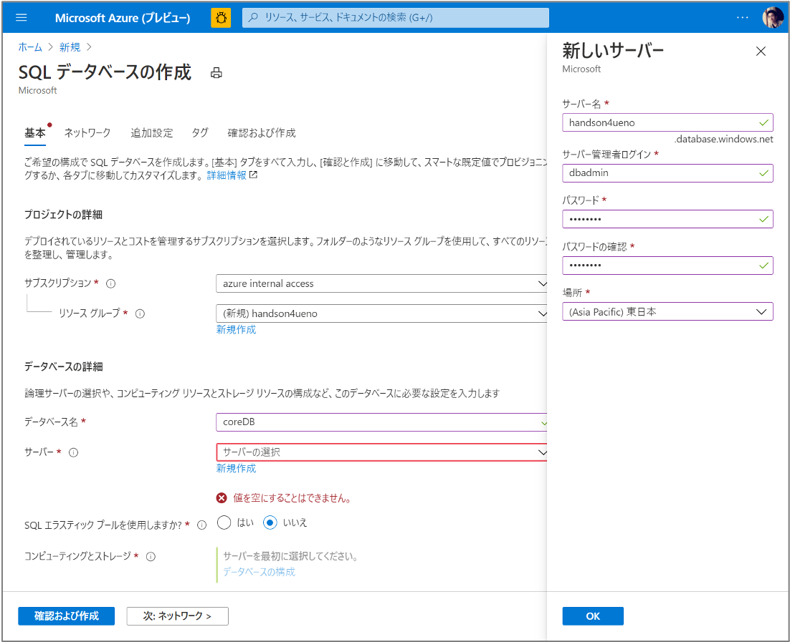

# Azure Kubernetes Service + SQL Server ハンズオン (2021年1月 更新)

このハンズオンでは、次の図に示すように Azure Kubernetes Service (AKS) と SQL Server を連携させた ToDo アプリを設置する方法を実践します。設置作業は、 Azure ポータルと Azure Cloud Shell を用いて行います。

## 0. 事前準備

このハンズオンでは、 Azure ポータルと Azure Cloud Shell で作業を行います。予めAzureアカウントの取得とサブスクリプションの作成、及び、会社でアカウントが払い出された場合、適切なアクセス権の設定が必要となります。


## 1. SQL Database の作成

ここでは SQL Database を作成します。 SQL Database の作成とは、 SQL Server を設置して、 SQL Server 上にデータベースを作成していくという手順となります。 Azure では SQL Database 作成画面で SQL Server を作成することが可能です。


### 1-1. Azure ポータルからデータベースを作成

まず、SQL Database 作成画面へ移動します。Azure ポータルの左上にあるアイコンをクリックして、メニューを開き、「リソースの作成」ボタンをクリックします。

<div align="center">
    
</div>

次にSQL Databaseをメニューで選択します。

<div align="center">
    
</div>

次に SQL Database 作成のフォームが表示されるので、次のように入力します。SQL Database 作成画面で 「サーバ > 新規作成」を押すと、画面の右側に SQL Server の作成画面が現れます。ここでは、SQL Serverも同時に作成します。

<div align="center">
    
</div>

作成する SQL Server の情報は次のようになります。

| パラメータ名 | 値 |
| ---------- | -- |
| サーバ名 | handson4<名字> |
| サーバ管理者ログイン | dbadmin |
| パスワード | P@ssw0rd |
| 場所 | 東日本 |

作成する SQL Database の情報は次のようになります。

| パラメータ名 | 値 |
| ---------- | -- |
| リソースグループ | handson4<名字> |
| データベース名 | coreDB |
| エラスティックプール | いいえ |
| コンピューティングストレージ | サーバレス、Gen5、1 vCore、1 GB ストレージ |

入力が完了したら、「次: ネットワーク」ボタンを押し次のページに進みます。

<div align="center">
    
</div>

ネットワーク情報の設定画面では、次のように設定します。

※ クエリエディタでテーブルが作成されたことを確認する場合、「ファイアウォール規則：現在のクライアント」の値を「はい」に設定する必要があります。ただし、運用データベースではこの設定は推奨されません。

| パラメータ名 | 値 |
| ---------- | -- |
| 接続方法 | パブリック エンドポイント |
| ファイアウォール規則：Azure サービス | はい |
| ファイアウォール規則：現在のクライアント | いいえ |

入力が完了したら、「次：追加機能」ボタンを押し、次のページに進みます。

<div align="center">
    
</div>

追加機能画面では、「Azure Defender for SQL の有効化」を「後で」に変更し、「確認および作成」ボタンを押します。確認の結果、エラーが発生しなければ、「作成」ボタンを押して、SQL Database の作成を行います。

| パラメータ名 | 値 |
| ---------- | -- |
| 既存データの使用 | なし |
| 照合順序（変更なし） | SQL_Latin1_General_CP1_CI_AS |
| Azure Defender for SQL | 後で |


### 1-2. Azure Cloud Shell で SQL データベースにテーブルを作成

ここでは、SQLデータベースにテーブルを作成します。テーブルの作成には、.NETに用意されているEntity Frameworkを利用して、ソースコードから自動的にテーブルを作成します。ここでの操作は、全てCloud Shell上で実行します。

まず、ToDoアプリのソースコードをCloud Shellにダウンロードします。

```
git clone https://github.com/uenohajime/dotnetcore-sqldb-tutorial.git
```

次にダウンロードしたプロジェクト・フォルダに移動します。

```
cd dotnetcore-sqldb-tutorial
```

ソースコードの書き換えのため、エディタを起動します。ここで変更する内容は、もともと、ローカルのSQLiteをデータベースとして利用するアプリをSQL Databaseをデータベースとして利用するように書き換えます。

```
code .
```

Startup.cs ファイルを開き 31 - 32行目あたりにある次の行を、行の先頭に「//」を追記することでコメントアウトします。

```
services.AddDbContext<MyDatabaseContext>(options =>
    options.UseSqlite("Data Source=localdatabase.db"));
```

次にコメントアウトした行の次の行に、次の２行を追加します。

```
services.AddDbContext<MyDatabaseContext>(options =>
   options.UseSqlServer(Configuration.GetConnectionString("MyDbConnection")));
```

<div align="center">
    
</div>

次に既存のSQLiteアクセス用のソースコードを削除します。

```
rm Migrations -r
```

そして、dotnetコマンドの Entity Framework を使って、SQL Database用のソースコードを生成します。

```
dotnet ef migrations add InitialCreate
```

SQL Database へアクセスするための接続文字列を取得します。

```
az sql db show-connection-string --client ado.net --server handson4<名字> --name coreDB
```

ここで取得できる接続文字列は、User IDとPasswordの値はマスキングされているので、先ほど、SQLサーバを作成時に入力したあたいに置き換えてください。取得ができたら、その接続文字列を環境変数に保存します。

```
export ConnectionStrings__MyDbConnection="Server=tcp:handson4<名字>.database.windows.net,1433;Database=coreDB;User ID=dbadmin;Password=P@ssw0rd;Encrypt=true;Connection Timeout=30;"
```

最後にEntity Frameworkのコマンドを実行して、ソースコードに記述されたテーブルの定義をSQL Databaseに反映します。

```
dotnet ef database update
```

正しくテーブルが作成できたかについては、Azureポータル上でSQLデータベースへ移動し、「クエリエディター（プレビュー）」を選択し、ログインをします。

この時、下の図のように「テーブル」の中に「dbo.Todo」と言う名前のテーブルが存在することが確認できると、正しくテーブルの作成が完了したことになります。

<div align="center">
    
</div>

## 2. AKS 作成とWebアプリ設置
