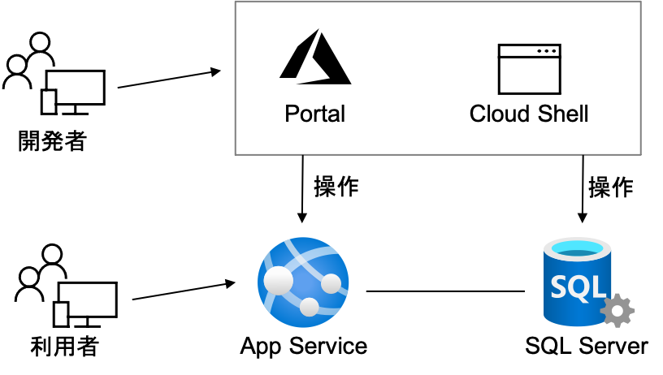

# Azure App Service + SQL Server ハンズオン (2020/11)

このハンズオンでは、次の図に示すように App Service と SQL Server を連携させた ToDo アプリを設置する方法を実践します。設置作業は、AzureポータルとAzure Cloud Shellを用いて行います。

    

## 0. 事前準備

このハンズオンでは、AzureポータルとAzure CloudShellで作業を行います。予めAzureアカウントの取得とサブスクリプションの作成、及び、会社でアカウントが払い出された場合、適切なアクセス権の設定が必要となります。

## 1. SQL Database の作成

ここでは SQL Database を作成します。

## 2. App Service 作成とWebアプリ設置

ここでは App Service を作成し、 Web アプリを設置します。

## 3. App Service への Web アプリの複数バージョン設置

ここでは App Service に複数のアプリを設置します。

## 4. App Service の Blue / Green デプロイメント

ここでは 1 つの App Service に設置された複数のアプリへアクセスするユーザの流れを調整します。

## 参考サイト

* [チュートリアル:Azure App Service での ASP.NET Core および Azure SQL Database アプリの作成](https://docs.microsoft.com/ja-jp/azure/app-service/tutorial-dotnetcore-sqldb-app?pivots=platform-windows)

## スライド

* [スライド (パスワード付き)](../../../pdf/AppService-NET-SQL-DB.zip)

